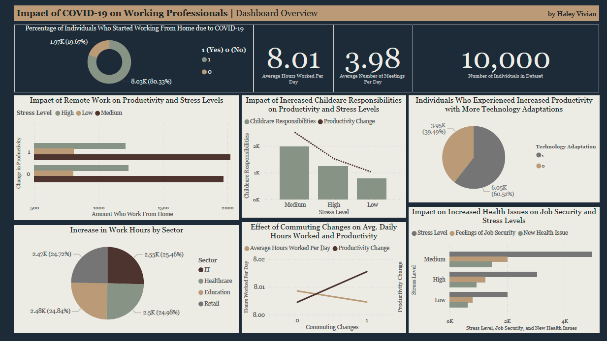

# Impact of COVID-19 on Working Professionals: Power BI Dashboard
## Project Overview
This project analyzes the impact of the COVID-19 pandemic on working professionals, focusing on employment status, remote work adoption, and salary changes across different industries.
- Tools: Power BI and Excel
- Dataset: [[Kaggle Dataset by Normie](https://www.kaggle.com/datasets/gcreatives/impact-of-covid-19-on-working-professionals/data)].

## Key Questions
This dashboard is designed to explore key insights into the long-term effects of COVID-19 on the workplace. By examining various dimensions such as work hours, productivity, and employee well-being, it aims to provide valuable behavioral analysis that highlights the pandemic's impact on working professionals. Additionally, this dashboard serves as a predictive model to facilitate informed decision-making and make relevant data accessible to stakeholders seeking to understand and address the evolving dynamics of the modern workplace.

These are the key questions to achieve the above stated goal:

- **How has the pandemic affected work hours?**
  - What percentage of individuals experienced an increase in work hours due to the pandemic?
  - Are there significant differences in work hour changes across different sectors?
    
- **What is the impact of remote work on productivity and stress levels?**
  - How does working from home correlate with reported productivity changes?
  - Is there a relationship between working from home and self-reported stress levels?
    
- **What are the effects of childcare responsibilities since the pandemic?**
  - How many individuals reported increased childcare responsibilities?
  - How do these responsibilities impact productivity and stress levels?

- **How has perception of job security changed since the pandemic?**
  - What percentage of indidivuals felt less secure in their jobs?
  - Is there a correlation between percieved job security and the development of new health issues?
 
- **What technological adaptations have employees made, and how do they relate to overall satisfaction?**
  - How many individuals had to adapt to new technologies for remote work?
  - Does technology adaptation relate to productivity or stress levels?
 
- **What is the relationship between commuting changes and work-life balance?**
  - How have commuting changes impacted work hours and stress levels?
  - Are there noticeable trends in commuting changes across different sectors?

## Variables defined in Database

| Variable                      | Type       | Description                                                                                      |
|-------------------------------|------------|--------------------------------------------------------------------------------------------------|
| Increased_Work_Hours          | Binary     | Indicates whether the individual's work hours have increased as a result of the pandemic. 1 for increased, 0 for unchanged or decreased. |
| Work_From_Home                | Binary     | Reflects whether the individual has started working from home due to the pandemic. 1 for yes, 0 for no. |
| Hours_Worked_Per_Day         | Continuous | The average number of hours the individual works per day, providing insight into changes in work duration during the pandemic. |
| Meetings_Per_Day             | Continuous | The average number of virtual meetings the individual attends per day, highlighting the shift in communication methods. |
| Productivity_Change           | Binary     | Indicates if the individual's productivity has changed due to the pandemic. 1 for increased or decreased productivity, 0 for no change. |
| Stress_Level                  | Categorical| Self-reported stress level, providing insights into the psychological impact of the pandemic on work life. |
| Health_Issue                  | Binary     | Indicates if the individual has developed new health issues (mental or physical) during the pandemic. 1 for yes, 0 for no. |
| Job_Security                  | Binary     | Perception of job security during the pandemic, with 1 indicating feeling less secure.          |
| Childcare_Responsibilities     | Binary     | Whether childcare responsibilities have increased as a result of the pandemic. 1 for increased responsibilities, 0 for no change or decreased. |
| Commuting_Changes             | Binary     | Reflects changes in commuting patterns due to the pandemic, such as reduced or no commuting. 1 for changes, 0 for no change. |
| Technology_Adaptation         | Binary     | Whether the individual had to adapt to new technologies for remote work. 1 for yes, 0 for no.  |
| Salary_Changes                | Binary     | Indicates if the individual experienced any salary changes during the pandemic. 1 for change (increase or decrease), 0 for unchanged. |
| Team_Collaboration_Challenges | Binary     | Indicates if there were challenges in collaborating with teams during the pandemic. 1 for yes, 0 for no. |
| Sector                        | Categorical| The sector in which the individual is employed, providing context for the data and potential sector-specific impacts. |
| Affected_by_Covid             | Binary     | Indicates whether the individual’s work life was affected by COVID-19. This column is biased towards affected individuals (predominantly 1s). |

## How to view the Dashboard!
- 
- To View and Download the Original Dashboard, go to the  folder and download the *.pbix* file. 
